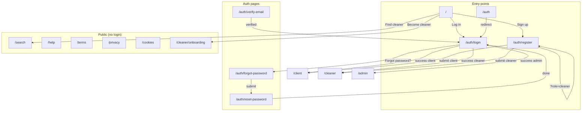
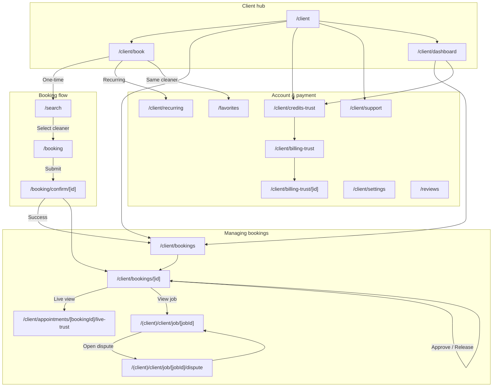
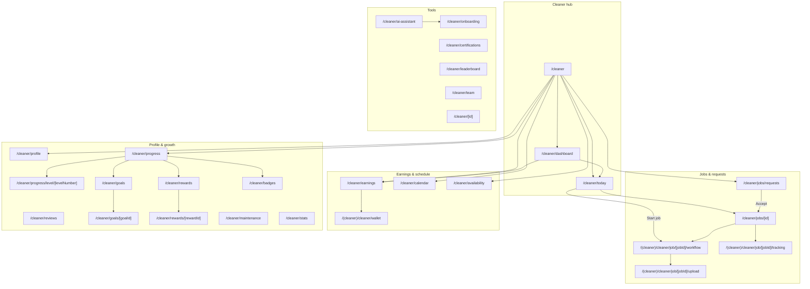
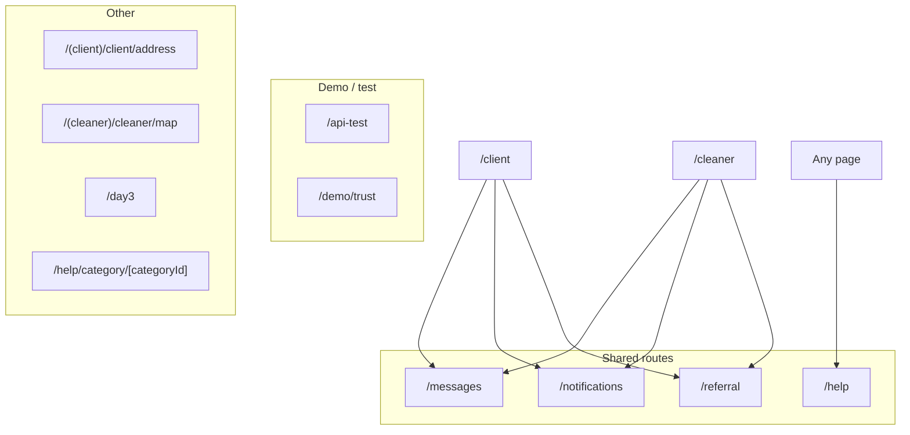

# Page Flowcharts — Every Route

Mermaid flowcharts for every page in the app. Use in any Markdown viewer that supports Mermaid (GitHub, VS Code, etc.).

---

## 1. App overview (by role)

```mermaid
flowchart TD
    subgraph Guest["Guest (not logged in)"]
        Landing["/"]
        Auth["/auth"]
        Login["/auth/login"]
        Register["/auth/register"]
        Forgot["/auth/forgot-password"]
        Reset["/auth/reset-password"]
        Verify["/auth/verify-email"]
        Search["/search"]
        Help["/help"]
        Terms["/terms"]
        Privacy["/privacy"]
        Cookies["/cookies"]
        Onboarding["/cleaner/onboarding"]
    end

    subgraph Client["Client (logged in)"]
        ClientHome["/client"]
        ClientBook["/client/book"]
        ClientBookings["/client/bookings"]
        ClientCredits["/client/credits-trust"]
        ClientBilling["/client/billing-trust"]
        ClientSettings["/client/settings"]
        ClientSupport["/client/support"]
        ClientRecurring["/client/recurring"]
        ClientDashboard["/client/dashboard"]
        Booking["/booking"]
        BookingConfirm["/booking/confirm/[id]"]
        BookingsDetail["/client/bookings/[id]"]
        LiveTrust["/client/appointments/[id]/live-trust"]
        Dispute["/client/job/[jobId]/dispute"]
        Favorites["/favorites"]
        Reviews["/reviews"]
    end

    subgraph Cleaner["Cleaner (logged in)"]
        CleanerHome["/cleaner"]
        CleanerToday["/cleaner/today"]
        CleanerDashboard["/cleaner/dashboard"]
        CleanerRequests["/cleaner/jobs/requests"]
        CleanerJobDetail["/cleaner/jobs/[id]"]
        Workflow["/cleaner/job/[jobId]/workflow"]
        Tracking["/cleaner/job/[jobId]/tracking"]
        Upload["/cleaner/job/[jobId]/upload"]
        CleanerEarnings["/cleaner/earnings"]
        CleanerCalendar["/cleaner/calendar"]
        CleanerAvailability["/cleaner/availability"]
        CleanerProfile["/cleaner/profile"]
        CleanerReviews["/cleaner/reviews"]
        Progress["/cleaner/progress"]
        Goals["/cleaner/goals"]
        Rewards["/cleaner/rewards"]
        Badges["/cleaner/badges"]
        Maintenance["/cleaner/maintenance"]
        Stats["/cleaner/stats"]
        AIAssistant["/cleaner/ai-assistant"]
    end

    subgraph Admin["Admin (logged in)"]
        AdminHome["/admin"]
        AdminUsers["/admin/users"]
        AdminBookings["/admin/bookings"]
        AdminDisputes["/admin/disputes"]
        AdminFinance["/admin/finance"]
        AdminGamification["/admin/gamification"]
        AdminSettings["/admin/settings"]
    end

    Landing --> Login
    Landing --> Register
    Landing --> Search
    Login --> ClientHome
    Login --> CleanerHome
    Login --> AdminHome
    Register --> ClientHome
    Register --> CleanerHome
    ClientHome --> ClientBook
    ClientHome --> ClientBookings
    ClientBook --> Booking
    Booking --> BookingConfirm
    CleanerHome --> CleanerToday
    CleanerHome --> CleanerRequests
    CleanerHome --> CleanerEarnings
    AdminHome --> AdminUsers
    AdminHome --> AdminGamification
```



---

## 2. Guest & Auth flow



---

## 3. Client flow (all pages)



---

## 4. Cleaner flow (all pages)



---

## 5. Admin flow (all pages)

```mermaid
flowchart TD
    subgraph Hub["Admin hub"]
        AH["/admin"]
        ADash["/admin/dashboard"]
    end

    subgraph Core["Core admin"]
        Users["/admin/users"]
        Bookings["/admin/bookings"]
        Disputes["/admin/disputes"]
        Finance["/admin/finance"]
        Analytics["/admin/analytics"]
        IDVer["/admin/id-verifications"]
        Comm["/admin/communication"]
        Risk["/admin/risk"]
        Settings["/admin/settings"]
        API["/admin/api"]
    end

    subgraph Gamification["Gamification"]
        GOverview["/admin/gamification"]
        GGoals["/admin/gamification/goals"]
        GGoalId["/admin/gamification/goals/[goalId]"]
        GRewards["/admin/gamification/rewards"]
        GRewardId["/admin/gamification/rewards/[rewardId]"]
        GChoices["/admin/gamification/choices"]
        GChoiceId["/admin/gamification/choices/[choiceId]"]
        GNewChoice["/admin/gamification/choices/new"]
        GFlags["/admin/gamification/flags"]
        GGovernor["/admin/gamification/governor"]
        GAbuse["/admin/gamification/abuse"]
        GSupport["/admin/support/cleaner/[cleanerId]/gamification"]
    end

    subgraph Tools["Admin tools"]
        Tools["/admin/tools"]
        QuickResp["/admin/tools/quick-responses"]
        TemplateLib["/admin/tools/template-library"]
        TemplateEdit["/admin/tools/template-editor"]
        TemplateCreate["/admin/tools/template-creator"]
        TestAI["/admin/tools/test-ai-assistant"]
        Leaderboard["/admin/tools/leaderboard"]
        OnboardWiz["/admin/tools/onboarding-wizard"]
        LegacyLogin["/admin/tools/legacy-admin-login"]
    end

    AH --> Users
    AH --> Bookings
    AH --> Disputes
    AH --> Finance
    AH --> GOverview
    AH --> Analytics
    AH --> Settings
    GOverview --> GGoals
    GOverview --> GRewards
    GOverview --> GChoices
    GOverview --> GFlags
    GOverview --> GGovernor
    GOverview --> GAbuse
    GGoals --> GGoalId
    GRewards --> GRewardId
    GChoices --> GChoiceId
    GChoices --> GNewChoice
    AH --> Tools
    Tools --> QuickResp
    Tools --> TemplateLib
    TemplateLib --> TemplateEdit
    TemplateLib --> TemplateCreate
```

---

## 6. Shared & cross-role pages



---

## 7. Per-page quick reference (flat list)

| Area | Route | Primary next steps |
|------|--------|--------------------|
| **Guest** | `/` | login, register, search, onboarding |
| | `/auth`, `/auth/login`, `/auth/register` | role home or forgot/verify |
| | `/auth/forgot-password`, `/auth/reset-password`, `/auth/verify-email` | back to login |
| | `/search`, `/help`, `/terms`, `/privacy`, `/cookies` | — |
| | `/cleaner/onboarding` | register |
| **Client** | `/client` | book, bookings, credits, support |
| | `/client/book` | search, recurring, favorites |
| | `/client/dashboard` | bookings, credits, book |
| | `/search` | booking (with cleaner) |
| | `/booking` | booking/confirm/[id] |
| | `/booking/confirm/[id]` | client/bookings or [id] |
| | `/client/bookings` | client/bookings/[id] |
| | `/client/bookings/[id]` | live-trust, job/[jobId], dispute |
| | `/client/appointments/[id]/live-trust` | back to booking |
| | `/(client)/client/job/[jobId]` | dispute |
| | `/(client)/client/job/[jobId]/dispute` | job |
| | `/client/credits-trust`, `/client/billing-trust`, `/client/billing-trust/[id]` | — |
| | `/client/settings`, `/client/support`, `/client/recurring` | — |
| | `/favorites`, `/reviews` | search, booking |
| **Cleaner** | `/cleaner` | today, requests, earnings, dashboard, availability |
| | `/cleaner/today`, `/cleaner/dashboard` | job detail, workflow |
| | `/cleaner/jobs/requests` | jobs/[id] |
| | `/cleaner/jobs/[id]` | workflow, tracking |
| | `/(cleaner)/cleaner/job/[jobId]/workflow` | upload, complete |
| | `/(cleaner)/cleaner/job/[jobId]/tracking`, `.../upload` | — |
| | `/cleaner/earnings`, `/(cleaner)/cleaner/wallet` | — |
| | `/cleaner/calendar`, `/cleaner/availability`, `/cleaner/profile` | — |
| | `/cleaner/reviews`, `/cleaner/progress`, `/cleaner/progress/level/[levelNumber]` | — |
| | `/cleaner/goals`, `/cleaner/goals/[goalId]` | — |
| | `/cleaner/rewards`, `/cleaner/rewards/[rewardId]` | — |
| | `/cleaner/badges`, `/cleaner/maintenance`, `/cleaner/stats` | — |
| | `/cleaner/ai-assistant`, `/cleaner/onboarding`, `/cleaner/certifications`, `/cleaner/leaderboard`, `/cleaner/team` | — |
| | `/cleaner/[id]` | public profile |
| **Admin** | `/admin`, `/admin/dashboard` | users, bookings, disputes, finance, gamification, settings |
| | `/admin/users`, `/admin/bookings`, `/admin/disputes`, `/admin/finance` | — |
| | `/admin/analytics`, `/admin/id-verifications`, `/admin/communication`, `/admin/risk`, `/admin/settings`, `/admin/api` | — |
| | `/admin/gamification` | goals, rewards, choices, flags, governor, abuse |
| | `/admin/gamification/goals`, `.../goals/[goalId]` | — |
| | `/admin/gamification/rewards`, `.../rewards/[rewardId]` | — |
| | `/admin/gamification/choices`, `.../choices/[choiceId]`, `.../choices/new` | — |
| | `/admin/gamification/flags`, `.../governor`, `.../abuse` | — |
| | `/admin/support/cleaner/[cleanerId]/gamification` | — |
| | `/admin/tools` | quick-responses, template-library, etc. |
| **Shared** | `/messages`, `/notifications`, `/help`, `/referral` | — |

---

*Generated from `APP_FLOWS.md` and `CUSTOMER_AND_CLEANER_FLOWS.md`. Render Mermaid in GitHub, VS Code (Mermaid extension), or [mermaid.live](https://mermaid.live).*
